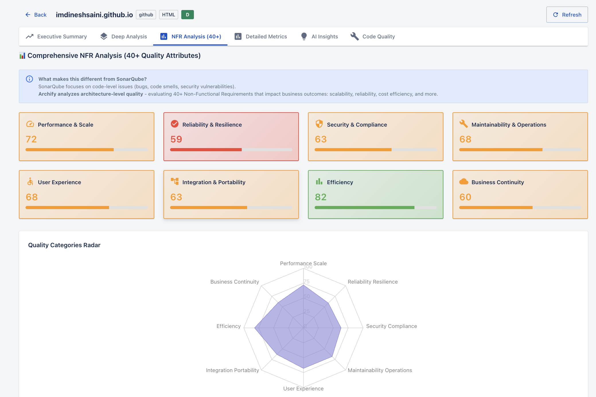
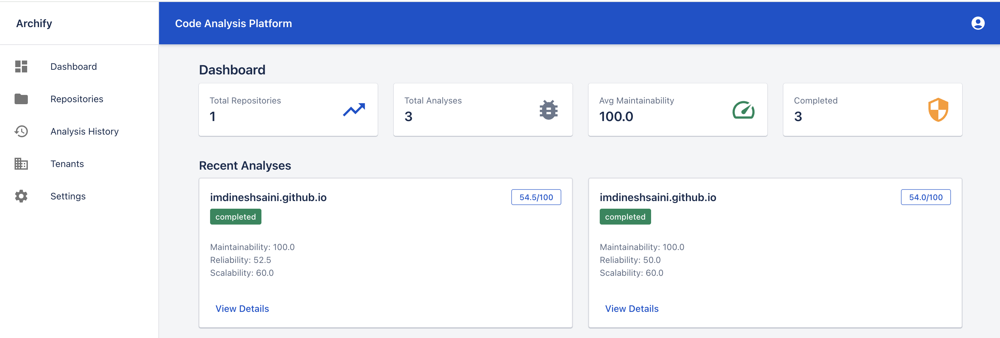

# Archify

AI-powered code analysis platform that helps engineering teams review architecture quality, identify technical debt, and get actionable improvement recommendations across their repositories.



## Why Archify?

Manual code reviews catch bugs but often miss architectural problems — poor modularity, scalability bottlenecks, security gaps, and mounting technical debt. Archify automates this by combining static analysis with AI to evaluate your codebase across 40+ quality attributes and give you a clear picture of where you stand.

## What It Analyzes

- **Maintainability** — complexity, function length, nesting depth, code duplication, comment coverage
- **Reliability** — error handling patterns, test coverage indicators, code consistency
- **Scalability** — architecture patterns, modularity, dependency management, design principles
- **Security** — vulnerability detection, injection risks, dependency issues, best practices
- **NFR Assessment** — 40+ non-functional requirements including performance, resilience, observability, portability, and more
- **Deep Analysis** — multi-layer AI examination across security, performance, testing, devops, and code quality with prioritized fix recommendations



## Key Features

- **Multi-layer Deep Analysis** — Security, Performance, Testing, DevOps, and Code Quality layers run in parallel with RAG-enhanced code context
- **40+ NFR Scoring** — Quality radar across Performance & Scale, Reliability, Security, Maintainability, User Experience, Integration, Efficiency, and Business Continuity
- **Structured Output** — LangChain 0.3 with Pydantic schemas ensures consistent, parseable results
- **Issue Triage** — Mark findings as Open, False Positive, Accepted, or Resolved
- **PDF Reports** — Comprehensive downloadable reports with clickable links to your source code
- **Multi-provider LLM** — Claude, OpenAI, or Azure OpenAI

> **Sample Report:** [Download a sample PDF report](docs/sample-report.pdf) generated from a real analysis.

## How It Works

1. Connect your GitHub or GitLab repository
2. Archify clones the repo and runs static analysis (Radon, Lizard, generic metrics for all languages)
3. Code is embedded into a vector store (FAISS) for RAG-powered context
4. AI performs deep architectural review across 5 layers in parallel
5. Get quality scores, visualizations, and prioritized recommendations

## Tech Stack

- **Backend:** FastAPI, PostgreSQL, Redis, LangChain 0.3, FAISS
- **Frontend:** React, Material-UI, Redux Toolkit
- **Analysis:** Radon, Lizard, Tree-sitter, Bandit, AI-powered insights
- **Deployment:** Docker Compose

## Quick Start

```bash
git clone https://github.com/ImDineshSaini/Archify.git
cd Archify
docker compose up -d
```

Open http://localhost:3000 to get started.

## Setup

1. **Register** — Go to `/register` and create an account. The first user is automatically promoted to **admin**.
2. **Configure LLM** — Go to Settings and add your API key for Claude, OpenAI, or Azure OpenAI.
3. **Connect Git** (optional) — Add a GitHub/GitLab access token in Settings for private repo access.
4. **Analyze** — Add a repository URL and start your first analysis.

## Local Development

See [docs/setup.md](docs/setup.md) for running without Docker.

## License

MIT
